# DOCUMENTATION ON IMPLEMENTATION OF MY PROJECT 4

`I did the first task of connecting to my  EC and using the EC2 terminal`

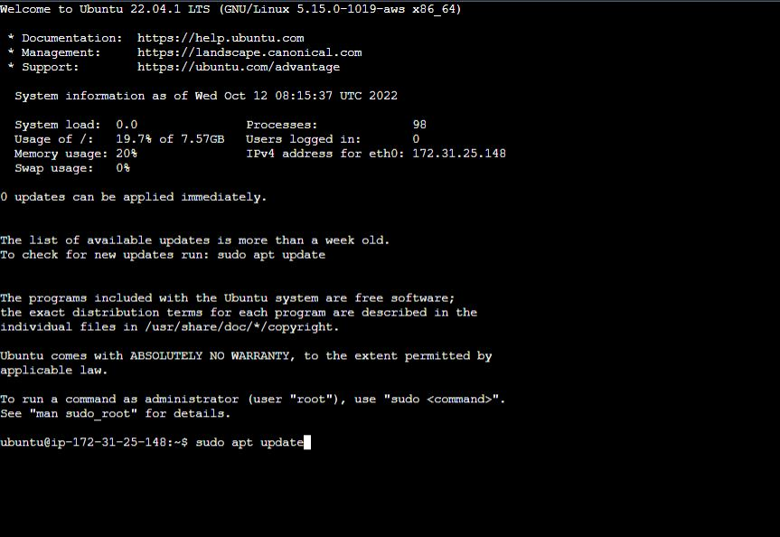

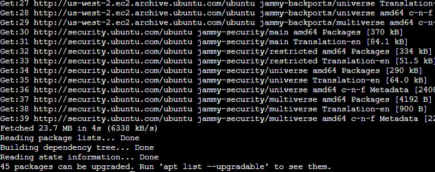 

`I added the certificates using the curl command`

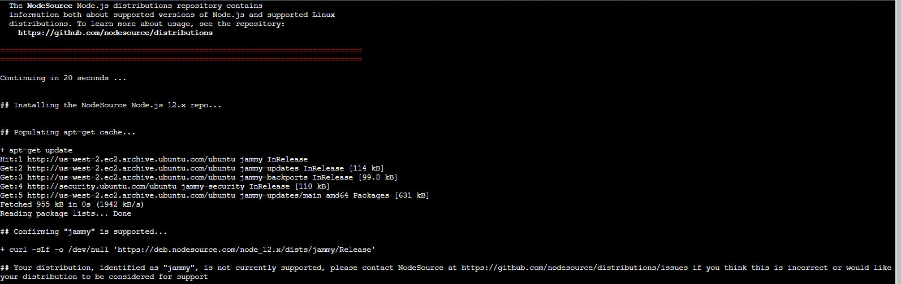

`I installed nodejs`

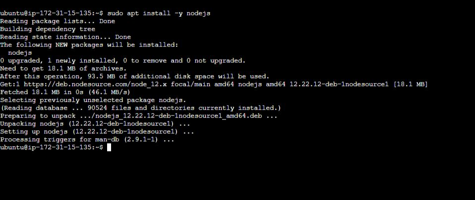

###  Install MongoDB

`I added book record to mongodb`

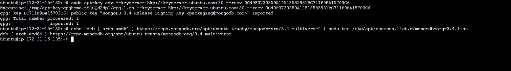

`I installed MongoDb`

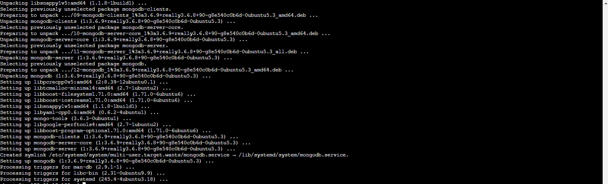

`I started Mongodb server`

`Cheked Mongodb status and it was running.`

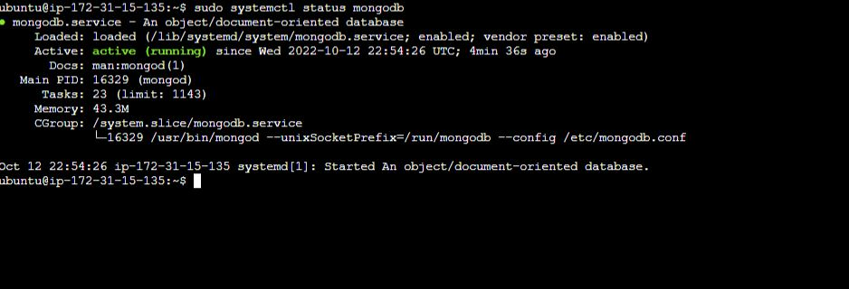

`I installed npm using nodejs installation as the sudo apt install npm was not working. Afterwards i installed body-praser package. After which i created a directory called Books and cd'ed into it. `

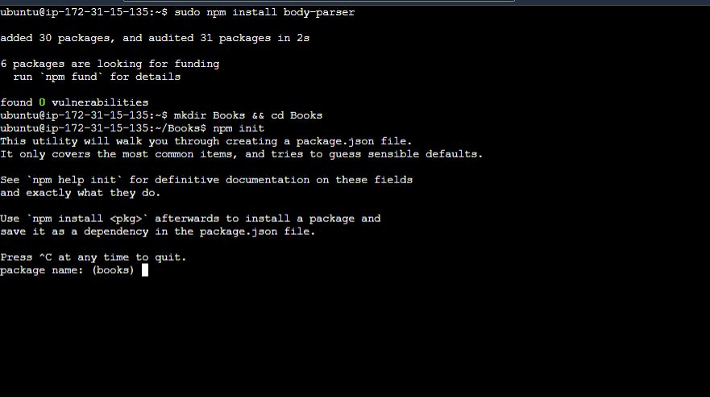

`I added a file using touch command and named the file named server.jsi. I copied and pasted the serevr code provided on the documenatation to the server file using the vi command. `

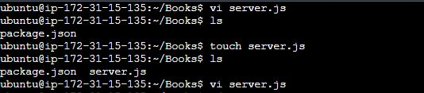

##  IINSTALL EXPRESS AND SET UP ROUTES TO THE SERVER

`I installed Express `

`I craated a directory called Apps and cd'ed into it and added a file using touch command and named the file named routes. I copied and pasted the code provided inside the routes file. `

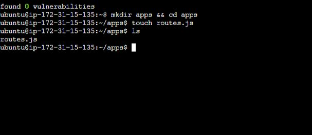
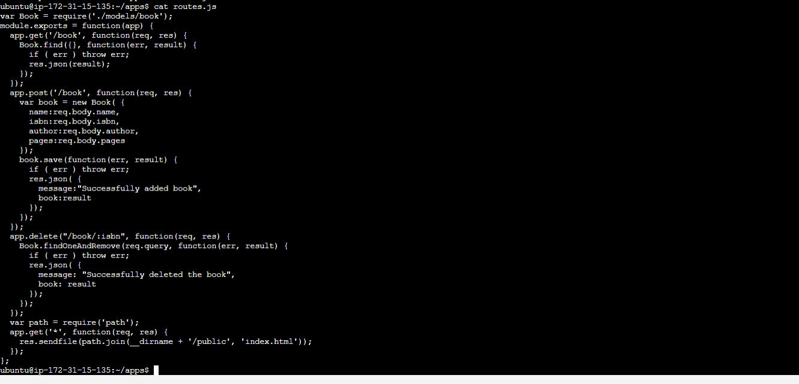

`I craated a directory inside Apps called Model and cd'ed into it and created a file using touch command and named the file named "book.js" I copied and pasted the code provided inside the file. `

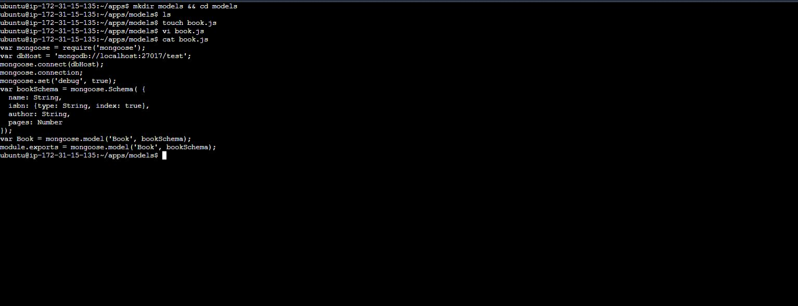

###  Step 4 – Access the routes with AngularJS

`I cd'ed back to Books and created a Directory named public and cd'ed into it. Inside the directory i created a file and named it "script.js"  I copied and pasted the code provided inside the file. `

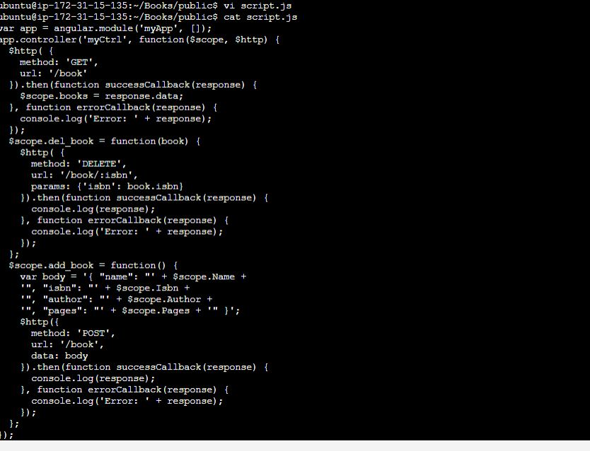

`I created a file named index.html in the public folder and eidted it by pasting the proived code in our dcoumentation. `

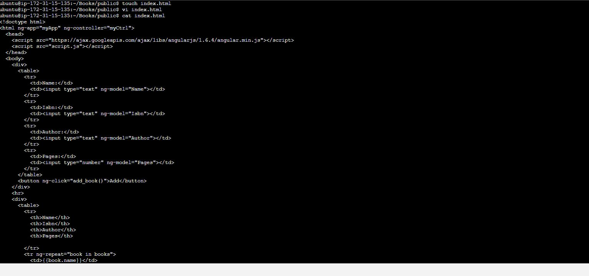

`I created a file named index.html in the public folder and eidted it by pasting the proived code in our dcoumentation. `

`I and my server using node server.js and the server was running after three attemps with returning error messgae. But finally it worked `

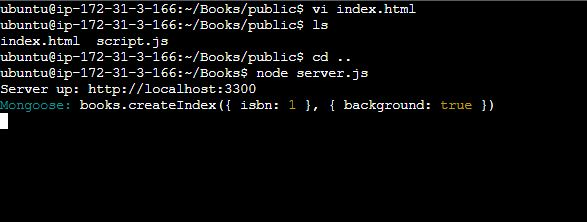

`I checked on my browser with after opening my TCP port 3300 on my inbound rule and it was working on the web browser `

